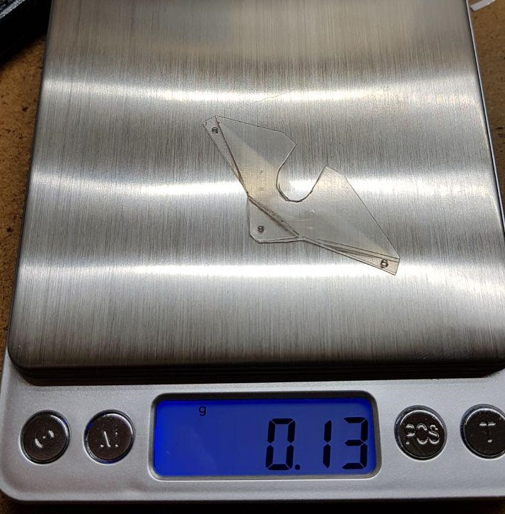

Quite lightweight camera holder for tinywhoop.

Process:

1. open the "canopy.dwg" in DraftSight (or other CAD software) 
2. print on paper 1:1
3. stick to plastic with Scotch tape
4. cut out
5. bend
6. screw on
7. enjoy ;)

